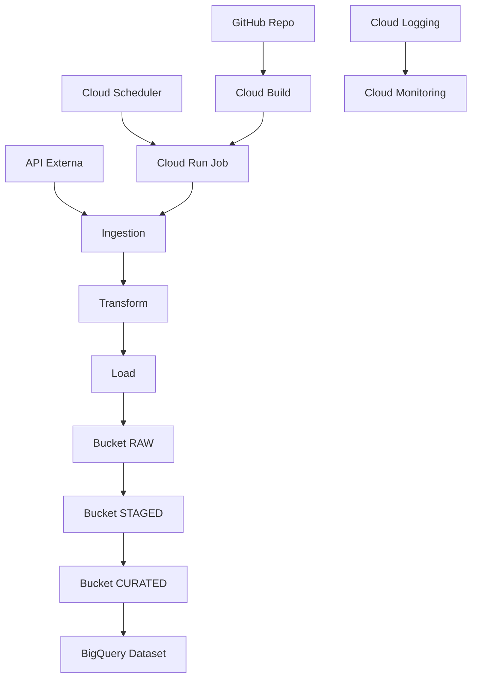

# Data Architecture Demo

Este repositório demonstra uma arquitetura de dados moderna, escalável e de baixo custo construída na Google Cloud Platform (GCP), utilizando Python, Cloud Run Jobs, Cloud Scheduler, Cloud Build, BigQuery, Terraform e boas práticas de engenharia de dados. O projeto foi desenvolvido com apoio do Copilot, que acelerou decisões técnicas, geração de código, documentação e estruturação da arquitetura.

---

## 🎯 Objetivo

Criar uma arquitetura de dados completa, simples de replicar e ideal para demonstrações profissionais, entrevistas, portfólio e estudos. A solução implementa:

- Data Lake (Cloud Storage)
- Data Warehouse (BigQuery)
- ETL serverless (Cloud Run Jobs)
- Agendamento automático (Cloud Scheduler)
- CI/CD (Cloud Build)
- Infraestrutura como código (Terraform)
- Documentação visual completa

---

## 🏗️ Arquitetura

A arquitetura segue o padrão Medallion:

- **Raw** → dados brutos
- **Staged** → dados limpos e padronizados
- **Curated** → dados prontos para consumo analítico

### Componentes principais

- **Cloud Storage** — Buckets organizados por camadas (raw, staged, curated).
- **Cloud Run Jobs** — Execução serverless do pipeline ETL.
- **Cloud Scheduler** — Disparo automático do job.
- **BigQuery** — Dataset analítico.
- **Cloud Build** — Pipeline CI/CD que constrói a imagem Docker.
- **Terraform** — Provisionamento de buckets, dataset e demais recursos.
- **IAM / Service Accounts** — Controle de acesso e autenticação.
- **Cloud Logging & Monitoring** — Observabilidade completa.

---

## 📐 Diagrama da Arquitetura

O diagrama completo da arquitetura está disponível em `docs/architecture-diagram.png`.



---

## 📁 Estrutura do Repositório

```
data-architecture-demo/
│
├── infra/
│   ├── terraform/          # Infraestrutura como código
│   └── cloudbuild.yaml     # Pipeline CI/CD
│
├── src/
│   ├── ingestion/          # Pipelines de ingestão
│   ├── transform/          # Transformações
│   └── load/               # Carga para GCS e BigQuery
│
├── notebooks/              # Exploração e protótipos
│
├── docs/
│   ├── architecture.md     # Documentação detalhada
│   ├── architecture-diagram.png
│   ├── diagram.mmd         # Diagrama Mermaid
│   └── decisions.md        # ADRs (Architecture Decision Records)
│
├── tests/                  # Testes unitários
│
├── requirements.txt
├── .gitignore
└── README.md
```

---

## 🚀 Execução Local

### 1. Criar ambiente virtual

```bash
/opt/homebrew/opt/python@3.14/bin/python3 -m venv .venv
source .venv/bin/activate
pip install -r requirements.txt
```

### 2. Autenticação no GCP

```bash
gcloud auth application-default login
gcloud config set project data-architecture-demo-001
```

### 3. Executar o ETL

```bash
python src/main.py
```

---

## 🚀 Deploy em Produção

### 1. Construir imagem Docker

```bash
gcloud builds submit --tag gcr.io/$PROJECT_ID/data-etl
```

### 2. Criar Cloud Run Job

```bash
gcloud run jobs create etl-job \
  --image gcr.io/$PROJECT_ID/data-etl \
  --region southamerica-east1 \
  --service-account 26366089084-compute@developer.gserviceaccount.com
```

### 3. Executar manualmente

```bash
gcloud run jobs execute etl-job --region southamerica-east1
```

### 4. Agendar execução diária

```bash
gcloud scheduler jobs create http etl-job-schedule \
  --schedule="0 3 * * *" \
  --uri="https://southamerica-east1-run.googleapis.com/apis/run.googleapis.com/v1/namespaces/$PROJECT_ID/jobs/etl-job:run" \
  --http-method=POST \
  --oauth-service-account-email=26366089084-compute@developer.gserviceaccount.com
```

---

## 📊 Monitoramento

- Logs disponíveis no **Cloud Logging**
- Métricas no **Cloud Monitoring**
- Alertas configuráveis via políticas de monitoramento

---

## 🔐 Segurança e Governança

- Versionamento de objetos habilitado nos buckets
- Soft delete com retenção de 7 dias
- IAM granular via Service Accounts
- Auditoria via Cloud Audit Logs

---

## 🧪 Testes

```bash
pytest tests/
```

---

## 🤖 Como o Copilot ajudou neste projeto

O Copilot contribuiu em:

### Arquitetura
- Estrutura Medallion
- Organização dos componentes GCP
- Criação do diagrama visual

### Infraestrutura
- Geração dos arquivos Terraform
- Configuração de permissões IAM
- Pipeline Cloud Build

### Código
- Módulos de ingestão, transformação e carga
- Boas práticas em Python
- Testes unitários

### Documentação
- Estrutura completa do README
- ADRs
- Documentação visual

### GitHub
- Estrutura profissional do repositório
- Organização das pastas
- Orientação para commits

---

## 📬 Contato

Mario Jorge de Abreu Busch (mariojorgebusch@icloud.com)

Rio de Janeiro – Brasil

GitHub: https://github.com/mariojbusch

