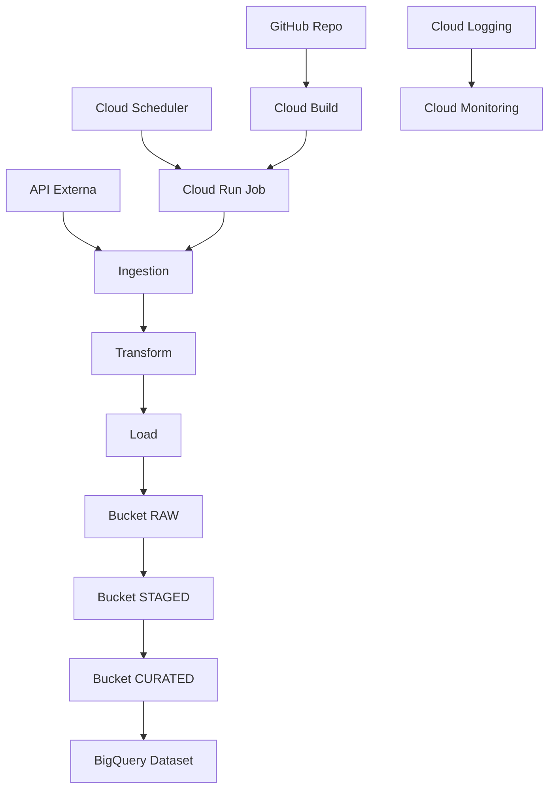

# Data Architecture Demo

Este repositório demonstra uma arquitetura de dados moderna, escalável e de baixo custo construída na Google Cloud Platform (GCP), utilizando Python, Cloud Run Jobs, Cloud Scheduler, Cloud Build, BigQuery, Terraform e boas práticas de engenharia de dados.

---

## 🎯 Objetivo
Criar uma arquitetura de dados completa, simples de replicar e ideal para demonstrações profissionais, entrevistas, portfólio e estudos. A solução implementa:
- Data Lake (Cloud Storage)
- Data Warehouse (BigQuery)
- ETL serverless (Cloud Run Jobs)
- Agendamento automático (Cloud Scheduler)
- CI/CD (Cloud Build + GitHub Actions)
- Infraestrutura como código (Terraform)
- Documentação visual completa

---

## 🏗️ Arquitetura
A arquitetura segue o padrão Medallion:
- Raw → dados brutos
- Staged → dados limpos
- Curated → dados prontos para análise

### Componentes principais
- Cloud Storage
- Cloud Run Jobs
- Cloud Scheduler
- BigQuery
- Artifact Registry
- Cloud Build
- Terraform
- IAM / Service Accounts
- Cloud Logging & Monitoring

---

## 📐 Diagrama da Arquitetura
Disponível em `docs/architecture-diagram.png`.



---

# 🧱 Infraestrutura Necessária no GCP
Documentação completa para replicar o ambiente.

## 1. APIs obrigatórias
```
gcloud services enable \
  run.googleapis.com \
  cloudbuild.googleapis.com \
  artifactregistry.googleapis.com \
  cloudscheduler.googleapis.com \
  storage.googleapis.com \
  bigquery.googleapis.com
```

## 2. Service Account para CI/CD
```
gcloud iam service-accounts create github-deploy \
  --display-name="GitHub Deploy Service Account"
```

Nome final:
```
github-deploy@<PROJECT_ID>.iam.gserviceaccount.com
```

## 3. Permissões necessárias
| Role | Motivo |
|------|--------|
| roles/run.admin | Deploy do Cloud Run Job |
| roles/artifactregistry.writer | Push da imagem Docker |
| roles/cloudbuild.builds.editor | Execução do Cloud Build |
| roles/storage.admin | Acesso ao Data Lake |
| roles/serviceusage.serviceUsageConsumer | Uso das APIs |

Comando:
```
gcloud projects add-iam-policy-binding <PROJECT_ID> \
  --member="serviceAccount:github-deploy@<PROJECT_ID>.iam.gserviceaccount.com" \
  --role="roles/run.admin"
```
*(repita para cada role)*

---

## 4. Buckets do Data Lake
```
gsutil mb -l southamerica-east1 gs://<PROJECT_ID>-raw
gsutil mb -l southamerica-east1 gs://<PROJECT_ID>-staged
gsutil mb -l southamerica-east1 gs://<PROJECT_ID>-curated
```

Estrutura:
```
gs://<PROJECT_ID>-raw/raw/
```

---

## 5. Artifact Registry
```
gcloud artifacts repositories create data-architecture-demo \
  --repository-format=docker \
  --location=southamerica-east1
```

---

## 6. Cloud Run Job
```
gcloud run jobs deploy data-etl-job \
  --image="southamerica-east1-docker.pkg.dev/<PROJECT_ID>/data-architecture-demo/data-etl:latest" \
  --region="southamerica-east1" \
  --max-retries=0 \
  --command=python \
  --args=src/main.py \
  --set-env-vars="ENVIRONMENT=production,API_URL=https://jsonplaceholder.typicode.com/posts,TIMEOUT=30,OUTPUT_DIR=/tmp,GCS_BUCKET=<PROJECT_ID>-raw,GCS_PREFIX=raw"
```

---

## 7. Cloud Scheduler
```
gcloud scheduler jobs create http data-etl-schedule \
  --schedule="0 3 * * *" \
  --uri="https://southamerica-east1-run.googleapis.com/apis/run.googleapis.com/v1/namespaces/<PROJECT_ID>/jobs/data-etl-job:run" \
  --http-method=POST \
  --oauth-service-account-email=github-deploy@<PROJECT_ID>.iam.gserviceaccount.com
```

---

## 8. GitHub Actions — Secrets
| Secret | Valor |
|--------|-------|
| GCP_SA_KEY | JSON da service account |
| GCP_PROJECT_ID | ID do projeto |
| GCP_REGION | southamerica-east1 |

---

## 9. Observações sobre VPC-SC
- Cloud Build roda fora do perímetro
- Não usar `--gcs-log-dir`
- Logs ficam no bucket padrão `_cloudbuild`
- Streaming no GitHub pode não funcionar

---

# 🚀 Execução Local
```
python3 -m venv .venv
source .venv/bin/activate
pip install -r requirements.txt
python src/main.py
```

---

# 🚀 Deploy Manual
```
gcloud builds submit --tag gcr.io/$PROJECT_ID/data-etl
gcloud run jobs create etl-job --image gcr.io/$PROJECT_ID/data-etl --region southamerica-east1
```

---

# 📊 Monitoramento
- Cloud Logging
- Cloud Monitoring
- Alertas opcionais

---

# 🔐 Segurança
- Versionamento de objetos
- IAM granular
- Auditoria via Cloud Audit Logs

---

# 🧪 Testes
```
pytest tests/
```

---

# 🤖 Como o Copilot ajudou
- Arquitetura
- Infraestrutura
- Código
- Documentação
- GitHub Actions

---

# 📬 Contato
Mario Jorge de Abreu Busch — Rio de Janeiro, Brasil
GitHub: https://github.com/mariojbusch

