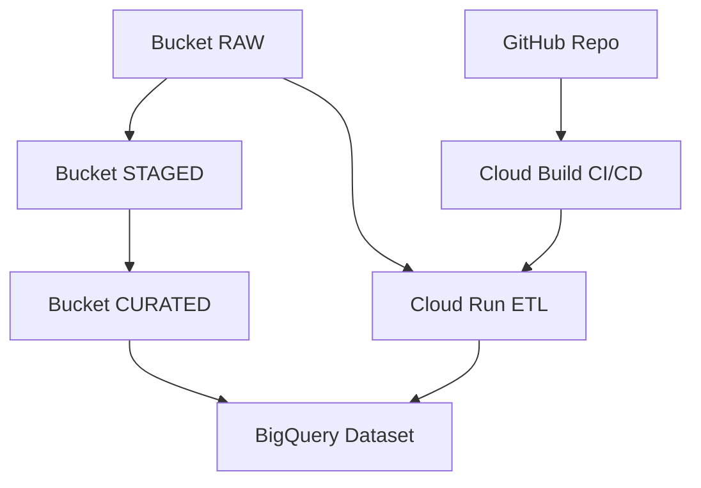

# Data Architecture Demo

Este repositório demonstra uma arquitetura de dados moderna, escalável e de baixo custo construída na Google Cloud Platform (GCP), utilizando Python, Terraform, Cloud Run, Cloud Build e boas práticas de engenharia de dados. O projeto foi desenvolvido com apoio do Copilot, que acelerou decisões técnicas, geração de código, documentação e estruturação da arquitetura.

---

## 🎯 Objetivo

Criar uma arquitetura de dados completa, simples de replicar e ideal para demonstrações profissionais, entrevistas, portfólio e estudos. A solução implementa:

- Data Lake (Cloud Storage)
- Data Warehouse (BigQuery)
- ETL em Python
- Deploy serverless (Cloud Run)
- CI/CD (Cloud Build)
- Infraestrutura como código (Terraform)
- Documentação e diagrama da arquitetura

---

## 🏗️ Arquitetura

A arquitetura segue o padrão Medallion:

- Raw → dados brutos
- Staged → dados limpos e padronizados
- Curated → dados prontos para consumo analítico

### Componentes principais

- **Cloud Storage** — Buckets organizados por camadas (raw, staged, curated).
- **BigQuery** — Dataset `data_architecture_demo` para armazenamento analítico.
- **Cloud Run** — Serviço serverless que executa pipelines ETL escritos em Python.
- **Cloud Build** — Pipeline CI/CD que constrói a imagem Docker e faz deploy automático.
- **Terraform** — Provisionamento de buckets, dataset e demais recursos.

---

## 📐 Diagrama da Arquitetura



---

## 📁 Estrutura do Repositório

```
data-architecture-demo/
│
├── infra/
│   ├── terraform/          # Infraestrutura como código
│   └── cloudbuild.yaml     # Pipeline CI/CD
│
├── src/
│   ├── ingestion/          # Pipelines de ingestão
│   ├── transformation/     # Transformações
│   └── load/               # Carga para BigQuery
│
├── notebooks/              # Exploração e protótipos
│
├── docs/
│   ├── architecture.md     # Documentação detalhada
│   ├── diagram.mmd         # Diagrama Mermaid
│   └── decisions.md        # ADRs (Architecture Decision Records)
│
├── tests/                  # Testes unitários
│
├── requirements.txt
├── .gitignore
└── README.md
```

---

## 🚀 Deploy e Execução

### 1. Autenticação no GCP

```bash
gcloud auth login
gcloud config set project data-architecture-demo-001
```

### 2. Provisionar infraestrutura com Terraform

```bash
cd infra/terraform
terraform init
terraform apply
```

### 3. Construir e enviar imagem Docker

```bash
gcloud builds submit --tag gcr.io/$PROJECT_ID/data-etl
```

### 4. Deploy no Cloud Run

```bash
gcloud run deploy data-etl \
  --image gcr.io/$PROJECT_ID/data-etl \
  --region southamerica-east1 \
  --platform managed
```

---

## 🧪 Testes

```bash
pytest tests/
```

---

## 🤖 Como o Copilot ajudou neste projeto

Este projeto foi desenvolvido com apoio contínuo do Copilot, que contribuiu em:

### 1. Arquitetura
- Sugestão da estrutura Medallion (raw → staged → curated)
- Organização dos componentes GCP
- Criação do diagrama Mermaid

### 2. Infraestrutura
- Geração dos arquivos Terraform
- Configuração de permissões IAM
- Criação do pipeline Cloud Build

### 3. Código
- Criação dos módulos de ingestão, transformação e carga
- Sugestões de boas práticas em Python
- Estruturação dos testes unitários

### 4. Documentação
- Estrutura completa do README
- Criação de ADRs
- Explicação da arquitetura e fluxos

### 5. GitHub
- Estrutura profissional do repositório
- Organização das pastas
- Orientação para commits e push

O Copilot atuou como um assistente técnico, acelerando decisões, reduzindo erros e garantindo consistência entre os componentes da arquitetura.

---

## 📬 Contato

Mario Jorge de Abreu Busch (mariojorgebusch@icloud.com)

Rio de Janeiro – Brasil

GitHub: https://github.com/mariojbusch

