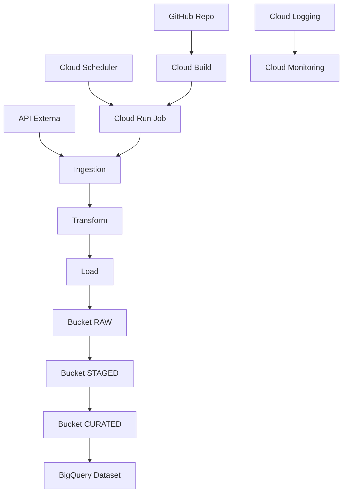

# Arquitetura — Data Architecture Demo

Este documento descreve a arquitetura completa do projeto **Data Architecture Demo**, incluindo fluxo de dados, componentes GCP, camadas do Data Lake, execução do ETL e governança.

---

## 🧩 Visão Geral

A arquitetura implementa um pipeline ETL moderno, escalável e totalmente serverless utilizando:

- **Cloud Run Jobs** para execução do ETL
- **Cloud Scheduler** para agendamento
- **Cloud Storage** como Data Lake
- **BigQuery** como Data Warehouse
- **Cloud Build** para CI/CD
- **Terraform** para provisionamento
- **IAM** para segurança e governança

O fluxo segue o padrão **Medallion Architecture**:

```
Raw → Staged → Curated
```

---

## 🔄 Fluxo de Dados (ETL)

1. **Ingestion**
   - Coleta dados de uma API externa
   - Salva arquivo temporário em `/tmp`

2. **Transform**
   - Normaliza JSON
   - Remove campos desnecessários
   - Gera arquivo transformado

3. **Load**
   - Envia para o bucket `data-architecture-demo-raw`
   - Caminho final: `raw/api_data_<timestamp>.json`

4. **Staged e Curated**
   - Pipelines secundários movem dados para `staged` e `curated`
   - BigQuery consome dados da camada curated

---

## 🏗️ Componentes da Arquitetura

### Cloud Run Jobs
- Execução serverless do ETL
- Usa Service Account com permissões de Storage
- Escala automaticamente

### Cloud Scheduler
- Dispara o job diariamente às 03:00
- Autenticação via OAuth

### Cloud Storage (Data Lake)

| Camada | Bucket | Função |
|--------|---------|--------|
| Raw | `data-architecture-demo-raw` | Dados brutos |
| Staged | `data-architecture-demo-staged` | Dados limpos |
| Curated | `data-architecture-demo-curated` | Dados prontos para análise |

### BigQuery
- Dataset analítico
- Tabelas particionadas por data

### Cloud Build
- Constrói imagem Docker
- Faz deploy automático no Cloud Run Jobs

### Terraform
- Provisiona buckets, dataset, service accounts e permissões

---

## 📐 Diagrama da Arquitetura

O diagrama visual completo está disponível em:

```
docs/architecture-diagram.png
```

Diagrama Mermaid:



---

## 🔐 Segurança e Governança

- Versionamento de objetos habilitado
- Soft delete com retenção de 7 dias
- IAM granular via Service Accounts
- Auditoria via Cloud Audit Logs

---

## 📊 Observabilidade

### Cloud Logging
- Logs estruturados
- Logs de execução do Cloud Run Job

### Cloud Monitoring
- Métricas de latência
- Métricas de sucesso/falha
- Alertas configuráveis

---

## 🚀 Próximos Passos

- Pipeline de carga para BigQuery
- Dashboard analítico no Looker Studio
- Alertas automáticos no Monitoring
- Versionamento de tabelas curated

---

## 📬 Contato

Mario Busch (mariojorgebusch@icloud.com)

Rio de Janeiro, Brasil

GitHub: https://github.com/mariojbusch